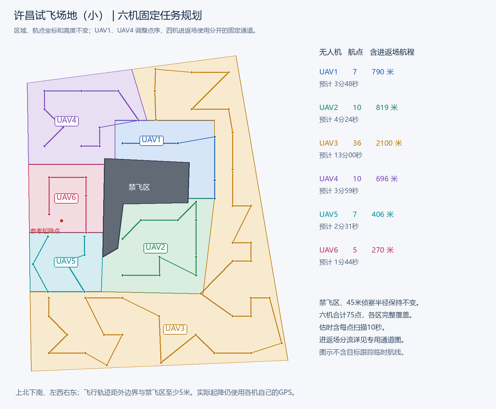
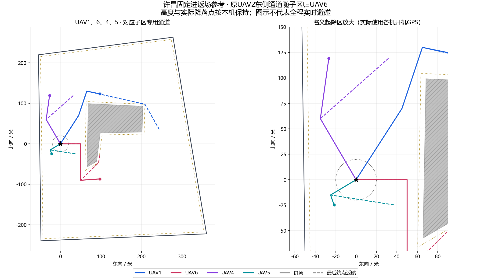
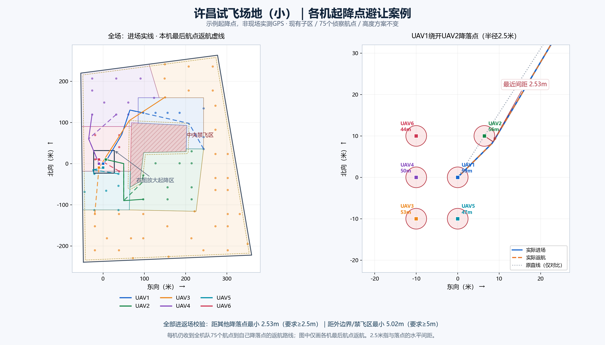

# 许昌试飞场地（小）固定方案

坐标基准为 WGS84 十进制度。下表按「纬度、经度」书写；机载外部程序 B 的航点话题仍按 `[经度, 纬度, 相对高度]` 发布。

外边界与固定起点保持原坐标，场地外边界按下表顺序闭合：

| 外边界点 | 纬度 | 经度 |
| --- | ---: | ---: |
| 1 | 34.136123 | 113.908559 |
| 2 | 34.136278 | 113.912981 |
| 3 | 34.140655 | 113.912085 |
| 4 | 34.140263 | 113.908491 |

固定起点：纬度 **34.138282**、经度 **113.909077**。

## 新禁止飞行区域

原矩形扣除区已删除，由以下六点依次闭合形成新的禁飞区。区内不侦察，侦察航段、进场和返航路线均不得穿越，且距其边界至少 5 米。

| 禁飞区角点 | 纬度 | 经度 |
| --- | ---: | ---: |
| 1 | 34.139176470619766 | 113.90981948390986 |
| 2 | 34.13911894613526 | 113.91127900740348 |
| 3 | 34.13854369913638 | 113.9112600525529 |
| 4 | 34.13852278098991 | 113.91014171636951 |
| 5 | 34.13789000461156 | 113.91004694211667 |
| 6 | 34.13776449468414 | 113.90978789249225 |

外边界面积约 175974.5 平方米，新禁飞区约 11285.6 平方米，剩余约 164688.9 平方米全部按侦察半径 **45 米**覆盖。航速 **5 米/秒**、每点扫描 **10 秒**。

## 当前六机分区（2026-10-10）

以本轮修改前的固定方案作为参考，范围保存在 `xuchang_small_partition_reference.json`。重新生成时重复使用该参考，不会反复向南移动边界。

- UAV2 完整继承修改前 UAV1 的子区。
- UAV1 位于修改前 UAV3 的东北区域，最东侧不超过修改前 UAV1 的最东侧；调整北部范围，让 UAV4 北部子区与 UAV3 东侧区域保持整块连通。
- UAV4 为北部整块子区，UAV6 为其南侧西中部子区；原有数米宽细条已并入相邻主体，不保留独立小岛。
- UAV5 北界精确向南移动 30 米。南界比修改前 UAV1 最南侧向北收约 3.46 米，去掉斜角产生的细长尾巴，形成完整四边形。
- UAV3 填满其余东侧与南侧区域。它是较大的 L 形区域，保留足够宽的两臂；不能因为追求面积相等而遗漏边角或侵入禁飞区。

六个子区均为单个连通多边形，无重叠，合并后恰好覆盖全部可侦察区域。候选分区排除长宽比超过 3、最短边小于 70 米及过于零碎的形状；UAV4 和 UAV6 另检查外接矩形填充率，保证原西侧分区平整。

## UAV4 东侧六点转交 UAV3

在上述固定分区基础上，仅调整 UAV3 和 UAV4。UAV4 原第 **5～10 点**及对应东侧区域转交 UAV3，UAV4 保留原第 **1～4、11～16 点**，坐标不变，共 **10 点**。在本轮四机分流规划中，UAV1、UAV4 改为逆序执行原有航点，六机子区域及全部航点坐标均不改变。

分割线使用本地坐标（N 为北向米数，E 为东向米数）：`E = 135.873778786 − 0.3 × (N − 160)`。轻微斜切能让 UAV4 保留的十点完整覆盖西侧区域；垂直切线会在西侧子区顶部留下约 229 平方米漏扫。实际转移面积约 **15240.0 平方米**，外边界、禁飞区、侦察半径及高度不变。

UAV3 接收六点后，在新增区域补 **1 个侦察点**保证自身全覆盖，按安全短路线重新排序，共 **36 点**。该区域继续属于 UAV3；UAV3 不参加飞行时，不会自动把它的任务转给其他无人机。

UAV4 含进返场航程从 **1008.5 米降至 653.4 米**，估计执行时间从 **6分02秒降至3分51秒**。

东侧转区前快照与切线保存在 `xuchang_small_east_transfer_reference.json`；再次生成先应用局部转区，再应用四机专用通道和点序，不会重复转区或重复反转。



## UAV1、UAV2、UAV4、UAV5 专用进返场通道

只修改许昌场景的固定规划数据及实际 GPS 起降点连接；一键起飞、任务下发时机、飞行控制、返航触发、降落点、外部程序 B 和消息协议均保持原逻辑。

| 无人机 | 进返场方向 | 六机不同高度方案 |
| --- | --- | ---: |
| UAV1 | 北侧绕禁飞区；原七个侦察点逆序执行 | 59米 |
| UAV2 | 先向东侧通道门点，再从禁飞区南侧绕行 | 56米 |
| UAV4 | 西北侧通道；原十个侦察点逆序执行 | 50米 |
| UAV5 | 西南侧通道；侦察点及顺序不变 | 47米 |

UAV3、UAV6 保持原进返场规划方式，全部高度档仍可选择。实际分派时采用各机**本次开机首次有效、未解锁的GPS记录**作为各自起降点；重连或竞赛节点重启仍沿用同次开机记录。先重接“本机起降点 ↔ 本机通道门点”，再检查完整进返场路线，绕开其他已连接无人机降落点半径2.5米范围。保留不受影响的固定通道；只有受阻航段增加必要绕行，人工门点被避让区覆盖时绕过该门点，不改变侦察点。每架接收机仍收到全部75个航点的返航路线，均经过本机接近通道、返回本机降落点；正式JSON话题结构不变。

原 UAV1、UAV2 共用约89.6米进场段。新固定参考起点下，剔除起点20米范围后，四机进场与最终返航路线两两不交叉，最小平面间距约13.09米；UAV1/UAV2约19.17米，UAV1/UAV4约20.90米。以边长10米正方形四角作为起降点，检查24种机号排列，20米范围以外最小值超过11米。这些是已测布局下的几何结果，不能套用到任意实际GPS布局，也不覆盖扫描、目标跟踪、提前返航时的临时连接航段。近起降点路线仍会接近；本次没有增加实时避碰或起降调度控制。



## 航点与进返场路线

| 无人机 | 航点数 | 子区面积（平方米） | 含进返场航程（米） | 估计执行时间 |
| --- | ---: | ---: | ---: | ---: |
| UAV1 | 7 | 12679.1 | 789.8 | 3分48秒 |
| UAV2 | 10 | 22182.8 | 819.4 | 4分24秒 |
| UAV3 | 36 | 83978.1 | 2100.3 | 13分00秒 |
| UAV4 | 10 | 22149.8 | 695.8 | 3分59秒 |
| UAV5 | 7 | 10803.5 | 406.3 | 2分31秒 |
| UAV6 | 5 | 12895.6 | 270.2 | 1分44秒 |

基础分区曾比较 **143 个满足范围与紧凑度的候选**；固定快照转移 UAV4 东侧区域后，再对 UAV1、UAV2、UAV4、UAV5 应用专用通道。现合计 **75 个航点**，含进返场总航程约 **5081.8 米**。固定范围限制下各机工作量不同，因此不声称六机等时或已经达到全局最优。估时按 5 米/秒、每点扫描 10 秒计算，不包括外部程序 B 发现目标后的临时跟踪耗时。

所有侦察航点及连接航段、进场和返航路线距场地外边界、禁飞区边界至少 5 米。子区之间的分割线仅用于任务归属，不是额外禁飞边界。实际起降点若处于不足5米的缓冲区、禁飞区内，与其他落点过近，或其他落点遮挡侦察点导致无法满足2.5米避让，本次规划在任何任务发送前整体拒绝，并提示调整起降位置。

每机接收全机队全部 75 个航点到自身降落点的返航路线。本表及三维预览使用固定规划起点；实机 GPS 分派使用各机本次开机记录的起降点，并以其他已连接飞机的开机起降点作避让，不改变固定子区与侦察航点。

场景固定 GPS 坐标系，全部原高度档保持可选且不交换机号对应高度。六机不同高度为 UAV1～6 对应 59、56、53、50、47、44 米；“科目二高度”六机均为相对起飞点 50 米。

固定航点：`competition_backend/competition_backend/xuchang_small_prepared.json`；进返场航线：`competition_backend/competition_backend/external_transit_prepared.json`。运行时读取固定侦察/通道文件，在分派阶段按开机起降点重接并进行2.5米避让；起飞后不自动重规划。赛前修改区域后，依次运行：

```powershell
python tools/prepare_xuchang_small_plan.py
python tools/prepare_transit_routes.py
python tools/build_plans_3d.py
```

[查看三维规划](competition_plans_3d.html) · [查看平面规划图](xuchang_small_plan.png)


## 开机起降点避让案例



图中六个起降点均为**假设的示例GPS**，不是当前飞机实测数据。以原固定参考起点为原点（北、西，米）：UAV1=(0,0)，UAV2=(10,-6.4286)，UAV3=(-10,10)，UAV4=(0,10)，UAV5=(-10,0)，UAV6=(10,10)。特意让UAV2位于UAV1原进场直线上，蓝色实际路线绕开其降落点，橙色虚线为UAV1从最后航点返航。

示例由实际运行时规划函数生成，检查六架接收机的全部进场路线及6×75条返航路线：到其他落点的最小水平距离约**2.53米**，到外边界或禁飞区边界约**5.02米**，含少量数值余量。2.5米是对其他降落点的距离，不表示任意时刻两架飞行中的飞机都有此间距。

[示例规划JSON](xuchang_boot_home_example.json)可在[三维总览](competition_plans_3d.html)导入查看，明确为示例，不用于现场分派。程序 B 仍读取原entry_path/return_paths话题；本次不改变起飞、返航触发或飞控逻辑，也不修改程序 B。上述绕行由程序 B 使用下发路线执行，本工程自主模式原有飞控路径不变。

需使用支持 `boot_gps_home` 的竞赛机载版本（科目一比赛场景版本已包含），并更新地面端。缺少本次开机记录时提示更新机载端，在未解锁状态等待有效GPS；不以飞机移动后的当前位置静默代替。
